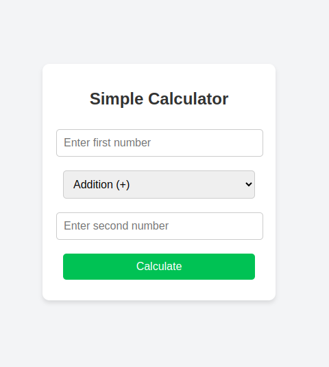
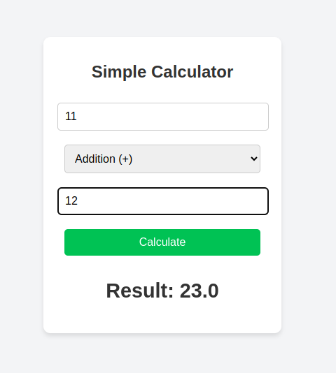
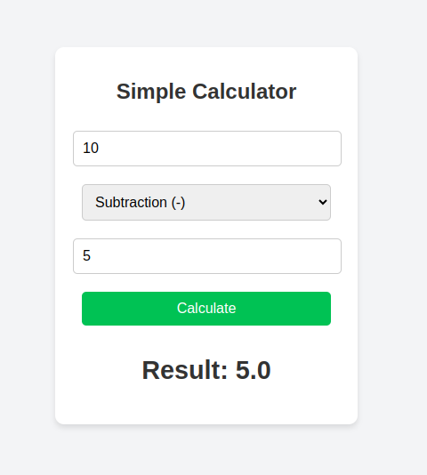
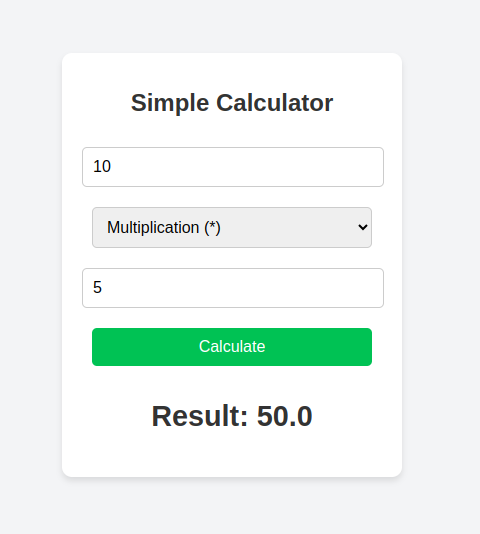
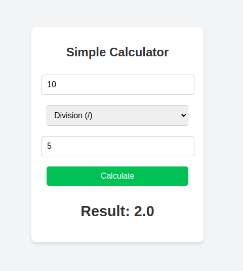

# Simple Calculator - OOP & Flask  

A **Simple Calculator** built using **Object-Oriented Programming (OOP) in Python** and a **Flask Web UI**. This calculator supports **basic arithmetic operations** and provides a clean user-friendly interface.

## 🔥 Features  
✅ Supports Addition, Subtraction, Multiplication, and Division  
✅ Built using **OOP principles** (Encapsulation, Static Methods)  
✅ Web UI created using **Flask & HTML/CSS**  
✅ Error handling for **invalid inputs & division by zero**  

## 📸 Screenshots  
### 🖥️ Web UI  
  

### 🔍 Example Calculation  
 




## 🛠️ Tech Stack  
- **Python (OOP Concepts)**  
- **Flask (Web Framework)**  
- **HTML & CSS (Frontend UI)**  

## 🚀 Installation & Usage  
### 1️⃣ Clone the Repository  
```bash
git clone https://github.com/your-username/simple-calculator-flask.git
cd simple-calculator-flask
```
## 2️⃣ Install Dependencies
```bash
pip install flask
```
## 3️⃣ Run the Application
```bash
python app.py
```
## 💡 How It Works
- The Calculator class defines the arithmetic operations.
- The Flask app handles user input and displays results on the web UI.
- The HTML/CSS UI provides a simple & interactive experience.

## 📂 Project Structure
simple-calculator-flask/<br>
├── app.py<br>
├── templates/<br>
│   └── index.html<br>
├── static/<br>
│   └── styles.css<br>
├── README.md<br>
├── screenshots/<br>
│   ├── ui.png<br>
│   └── result.png<br>

## 🏆 Future Enhancements
- Add more operations like exponentiation & modulus
- Display calculation history
- Improve UI with JavaScript animations

🌟 Contributing
Feel free to fork this repository and contribute improvements! 🤝

📌 Connect with Me
🔗 LinkedIn: https://www.linkedin.com/in/darpan-y-b-jain-880b6a255/ <br>
🔗 GitHub: github.com/DarpanYB38


